# 1 调试

## 1.1 获取验证码和随机码

在网站打开http://localhost:8080/login页面，获取到验证码code和随机码userKey

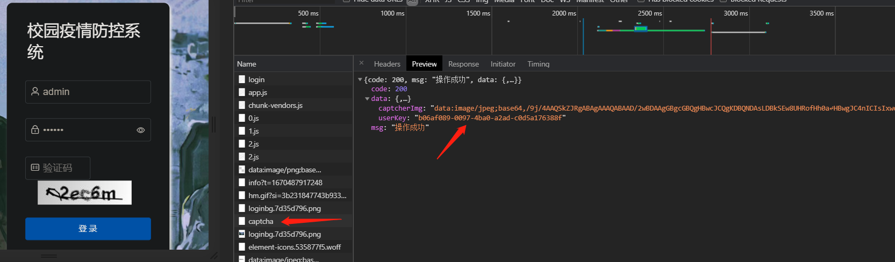

同时观察idea中日志的输出，也可以看到code和userKey
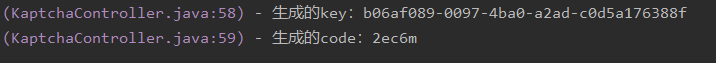
两者一致

### 1.1.1 前端的实现代码
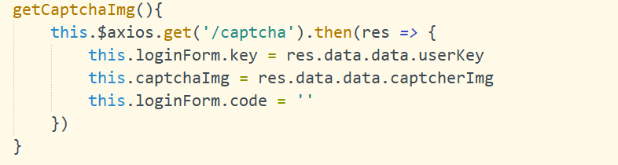
### 1.1.2 后端的实现代码
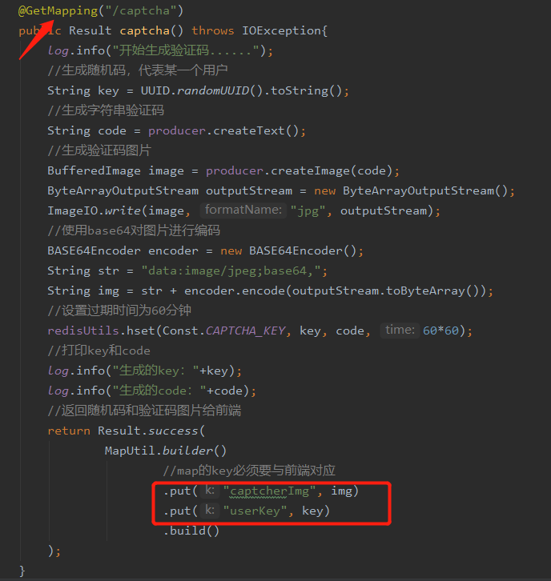

## 1.2 用户登录

### 1.2.1 使用postman调试

#### 1.2.1.1 成功的情况
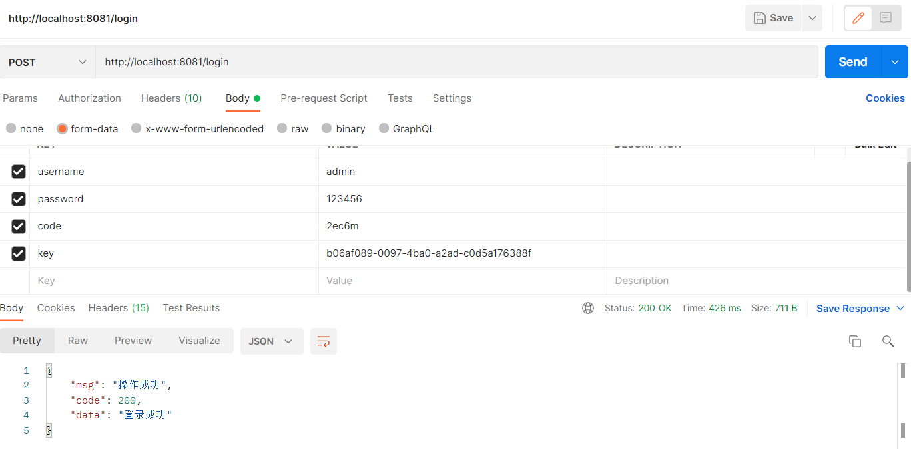
#### 1.2.1.2 失败的情况
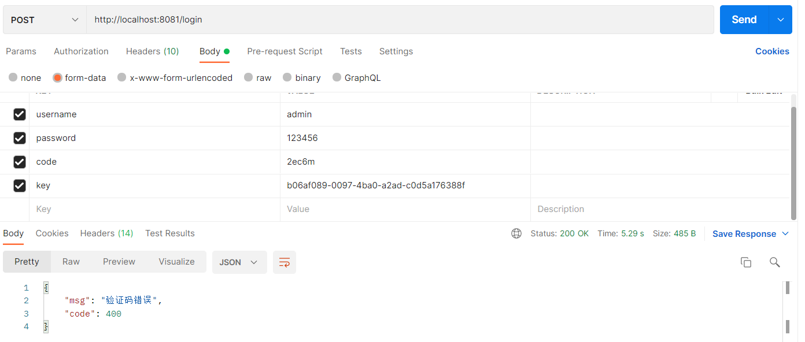

### 1.2.2 直接在网页输入，观察后台

#### 1.2.2.1 成功的情况
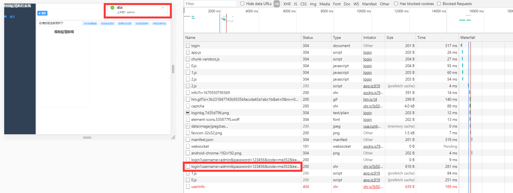
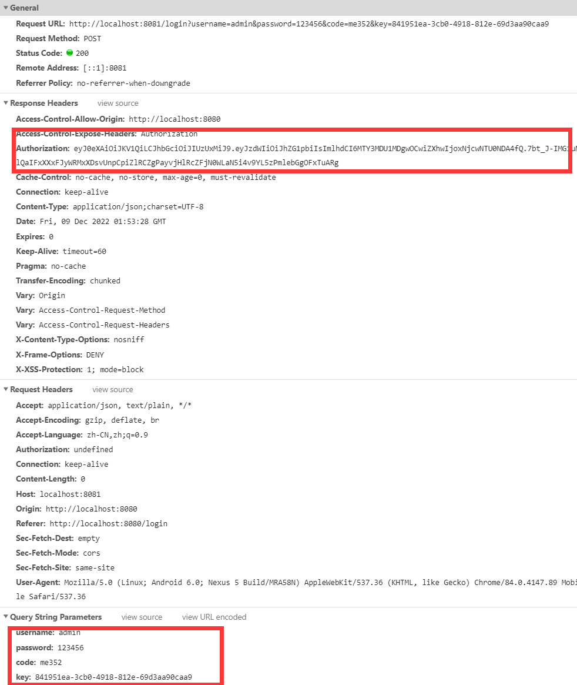
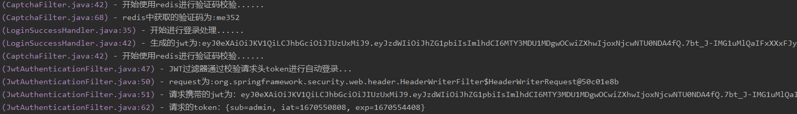
#### 1.2.2.2 失败的情况
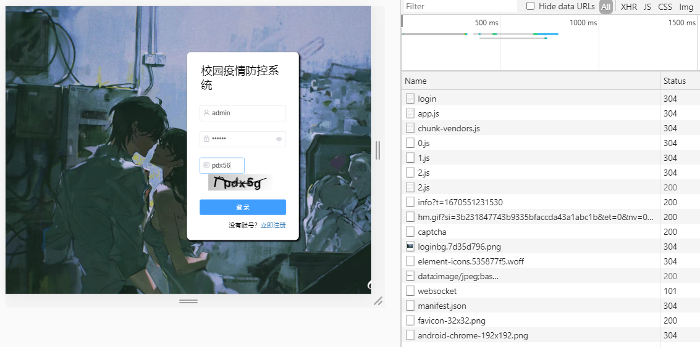
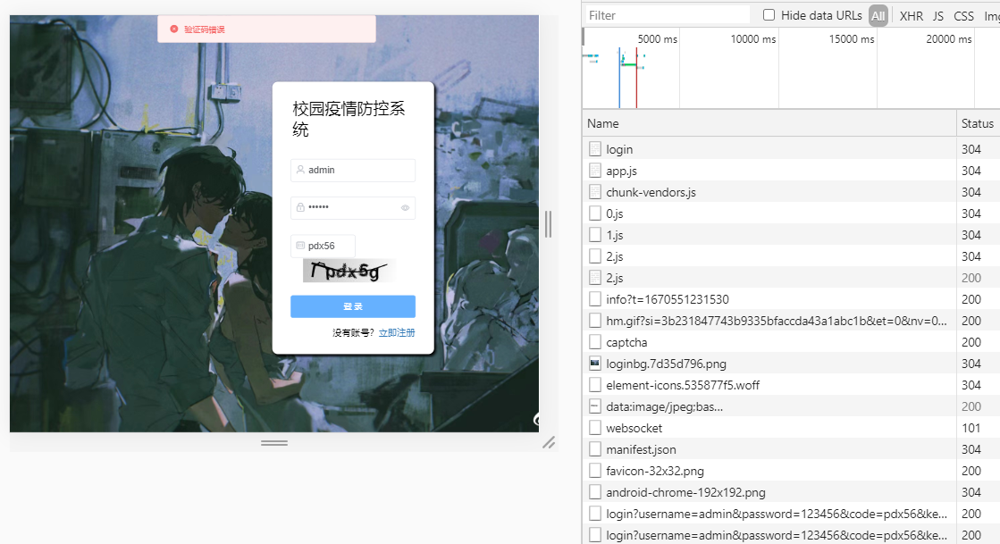
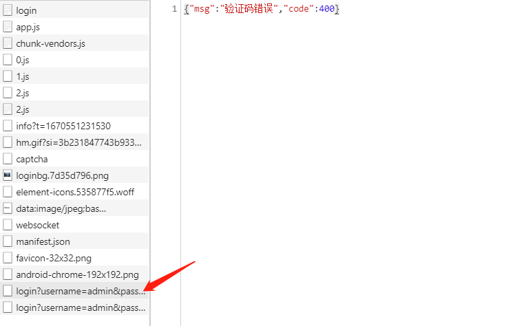

# 2 流程图
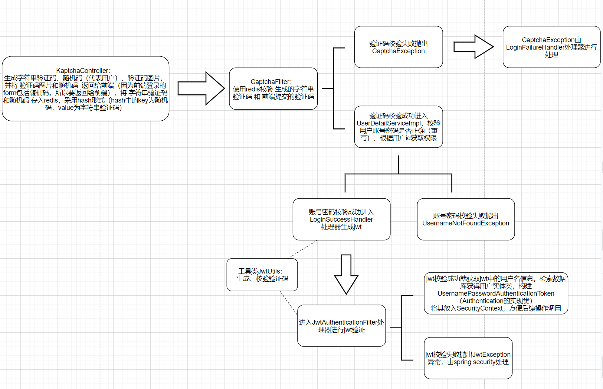
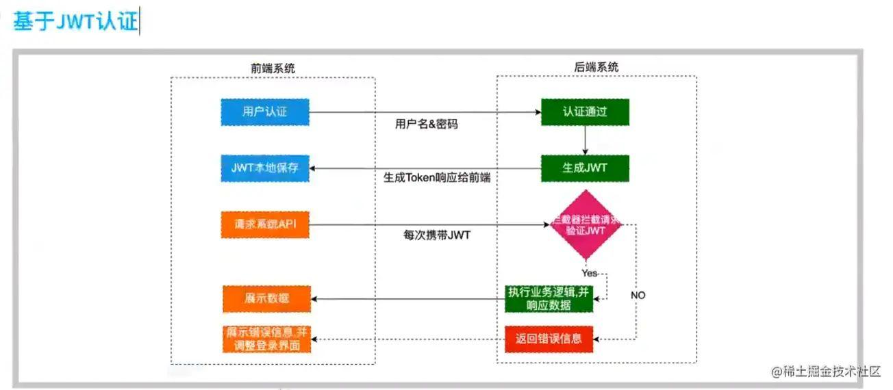

# 3 参考博客

https://juejin.cn/post/6846687598442708999#heading-1

https://authing.csdn.net/635780b3d3efff3090b5f5a4.html?spm=1001.2101.3001.6650.1&utm_medium=distribute.pc_relevant.none-task-blog-2%7Edefault%7ECTRLIST%7Eactivity-1-80779973-blog-91348402.pc_relevant_landingrelevant&depth_1-utm_source=distribute.pc_relevant.none-task-blog-2%7Edefault%7ECTRLIST%7Eactivity-1-80779973-blog-91348402.pc_relevant_landingrelevant&utm_relevant_index=2#devmenu1

https://blog.csdn.net/qq_44709990/article/details/123082560

https://juejin.cn/post/7135279063207411743

